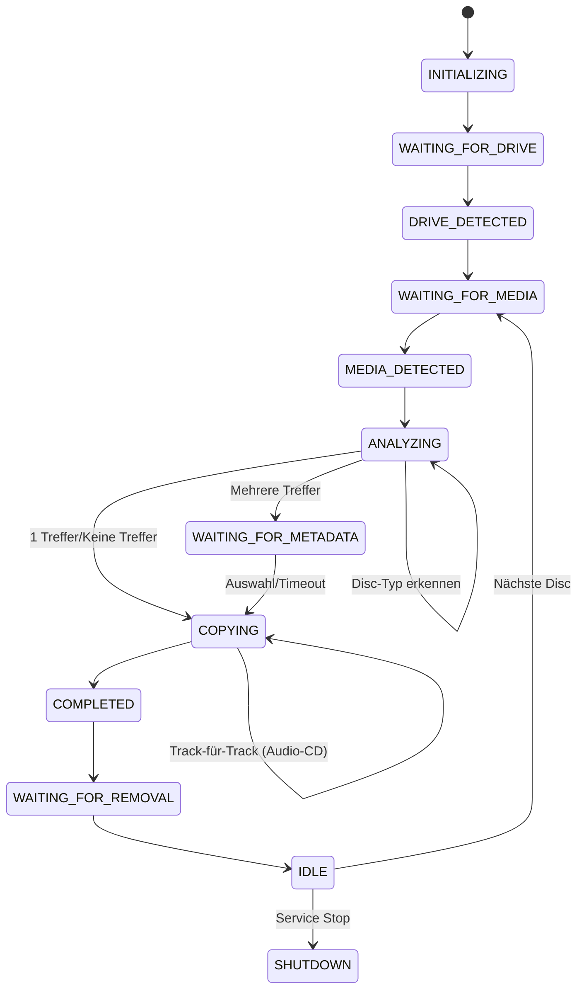

# Kapitel 8.3: Prozessanalyse - Workflow-Ablauf

Vollständige Analyse des disk2iso Workflow-Ablaufs mit allen Zuständen, Entscheidungspunkten und Verzweigungen.

## Übersicht

> **Legende der Disc-Typen:**  
> 🟡 **Daten-Disc** | 🟢 **Audio-CD** | 🔵 **DVD-Video** | 🟣 **Blu-ray Video**

---

## Workflow-Übersicht (Vereinfacht)

---

## Detaillierter Prozess-Ablauf

Der folgende Ablauf zeigt alle 44 Schritte des Workflows mit Verzweigungen für die verschiedenen Disc-Typen.

<strong>Hauptschleife-Indikator</strong>

**⟳ Hauptschleife**: Schritte 7-42 werden für jede eingelegte Disc wiederholt  
**↻ Track-Schleife**: Schritte 22-27 werden für jeden Audio-Track wiederholt

<table style="width: 100%; border-collapse: collapse; font-size: 0.9em;">
<thead>
    <tr style="background-color: #3498db; color: white;">
        <th style="padding: 10px; border: 1px solid #ddd;">#</th>
        <th style="padding: 10px; border: 1px solid #ddd;">State</th>
        <th colspan="15" style="padding: 10px; border: 1px solid #ddd;">Aufgaben</th>
    </tr>
</thead>
<tbody>
    <!-- INITIALISIERUNG -->
    <tr>
        <td style="padding: 8px; border: 1px solid #ddd;">1</td>
        <td style="padding: 8px; border: 1px solid #ddd; font-weight: bold;">INITIALIZING</td>
        <td rowspan="6" style="padding: 8px; border: 1px solid #ddd;"></td>
        <td colspan="14" style="padding: 8px; border: 1px solid #ddd;">System-Prüfung</td>
    </tr>
    <tr>
        <td style="padding: 8px; border: 1px solid #ddd;">2</td>
        <td style="padding: 8px; border: 1px solid #ddd; font-weight: bold;">INITIALIZING</td>
        <td colspan="14" style="padding: 8px; border: 1px solid #ddd;">Module laden</td>
    </tr>
    <tr>
        <td style="padding: 8px; border: 1px solid #ddd;">3</td>
        <td style="padding: 8px; border: 1px solid #ddd; font-weight: bold;">INITIALIZING</td>
        <td colspan="14" style="padding: 8px; border: 1px solid #ddd;">Core-Abhängigkeiten prüfen</td>
    </tr>
    <tr>
        <td style="padding: 8px; border: 1px solid #ddd;">4</td>
        <td style="padding: 8px; border: 1px solid #ddd; font-weight: bold;">WAITING_FOR_DRIVE</td>
        <td colspan="14" style="padding: 8px; border: 1px solid #ddd;">Suche nach optischem Laufwerk</td>
    </tr>
    <tr>
        <td style="padding: 8px; border: 1px solid #ddd;">5</td>
        <td style="padding: 8px; border: 1px solid #ddd; font-weight: bold;">DRIVE_DETECTED</td>
        <td colspan="14" style="padding: 8px; border: 1px solid #ddd;">Laufwerk-Bereitschaft prüfen</td>
    </tr>
    <tr>
        <td style="padding: 8px; border: 1px solid #ddd;">6</td>
        <td style="padding: 8px; border: 1px solid #ddd; font-weight: bold;">DRIVE_DETECTED</td>
        <td colspan="14" style="padding: 8px; border: 1px solid #ddd;">System-Informationen sammeln</td>
    </tr>
    
    <!-- MEDIEN-ERKENNUNG -->
    <tr>
        <td style="padding: 8px; border: 1px solid #ddd;">7</td>
        <td style="padding: 8px; border: 1px solid #ddd; font-weight: bold;">WAITING_FOR_MEDIA</td>
        <td rowspan="36" style="padding: 8px; border: 1px solid #ddd; background-color: #e8f4f8; border-left: 4px solid #3498db; border-right: 4px solid #3498db; font-size: 1.5em; font-weight: bold; text-align: center; vertical-align: middle; color: #2980b9;" title="Hauptschleife: Schritte 7-42 werden für jede Disc wiederholt">⟳</td>
        <td colspan="14" style="padding: 8px; border: 1px solid #ddd;">Prüfe ob Medium eingelegt</td>
    </tr>
    <tr>
        <td style="padding: 8px; border: 1px solid #ddd;">8</td>
        <td style="padding: 8px; border: 1px solid #ddd; font-weight: bold;">MEDIA_DETECTED</td>
        <td colspan="14" style="padding: 8px; border: 1px solid #ddd;">Warte auf Disc-Bereitschaft</td>
    </tr>
    <tr>
        <td style="padding: 8px; border: 1px solid #ddd;">9</td>
        <td style="padding: 8px; border: 1px solid #ddd; font-weight: bold;">ANALYZING</td>
        <td colspan="14" style="padding: 8px; border: 1px solid #ddd;">Auto-Mount entfernen</td>
    </tr>
    <tr>
        <td style="padding: 8px; border: 1px solid #ddd;">10</td>
        <td style="padding: 8px; border: 1px solid #ddd; font-weight: bold;">ANALYZING</td>
        <td colspan="14" style="padding: 8px; border: 1px solid #ddd;">Volume-Label extrahieren</td>
    </tr>
    <tr>
        <td style="padding: 8px; border: 1px solid #ddd;">11</td>
        <td style="padding: 8px; border: 1px solid #ddd; font-weight: bold;">ANALYZING</td>
        <td colspan="14" style="padding: 8px; border: 1px solid #ddd;">Temp-Verzeichnis zum Kopieren erstellen</td>
    </tr>
    <tr>
        <td style="padding: 8px; border: 1px solid #ddd;">12</td>
        <td style="padding: 8px; border: 1px solid #ddd; font-weight: bold;">ANALYZING</td>
        <td colspan="14" style="padding: 8px; border: 1px solid #ddd;">Disc-Typ erkennen</td>
    </tr>
    <tr>
        <td style="padding: 8px; border: 1px solid #ddd;">13</td>
        <td style="padding: 8px; border: 1px solid #ddd; font-weight: bold;">ANALYZING</td>
        <td colspan="1" rowspan="7" style="padding: 8px; border: 1px solid #ddd; background-color: #fff3e0;">🟡 Daten-Disc erkannt</td>
        <td rowspan="9" style="padding: 8px; border: 1px solid #ddd;"></td>
        <td colspan="4" style="padding: 8px; border: 1px solid #ddd; background-color: #e8f5e9;">🟢 Audio-CD erkannt</td>
        <td colspan="4" style="padding: 8px; border: 1px solid #ddd; background-color: #e3f2fd;">🔵 Video-DVD erkannt</td>
        <td colspan="4" style="padding: 8px; border: 1px solid #ddd; background-color: #f3e5f5;">🟣 Video-BD erkannt</td>
    </tr>
    
    <!-- METADATA-ABFRAGE -->
    <tr>
        <td style="padding: 8px; border: 1px solid #ddd;">14</td>
        <td style="padding: 8px; border: 1px solid #ddd; font-weight: bold;">ANALYZING</td>
        <td colspan="4" style="padding: 8px; border: 1px solid #ddd; background-color: #e8f5e9;">Track Anzahl ermitteln</td>
        <td colspan="4" style="padding: 8px; border: 1px solid #ddd; background-color: #e3f2fd;">Content-Typ ermitteln</td>
        <td colspan="4" style="padding: 8px; border: 1px solid #ddd; background-color: #f3e5f5;">Content-Typ ermitteln</td>
    </tr>
    <tr>
        <td style="padding: 8px; border: 1px solid #ddd;">15</td>
        <td style="padding: 8px; border: 1px solid #ddd; font-weight: bold;">ANALYZING</td>
        <td colspan="4" style="padding: 8px; border: 1px solid #ddd; background-color: #e8f5e9;">MusicBrainz Query</td>
        <td colspan="4" style="padding: 8px; border: 1px solid #ddd; background-color: #e3f2fd;">TMDB Query</td>
        <td colspan="4" style="padding: 8px; border: 1px solid #ddd; background-color: #f3e5f5;">TMDB Query</td>
    </tr>
    <tr>
        <td style="padding: 8px; border: 1px solid #ddd;">16</td>
        <td style="padding: 8px; border: 1px solid #ddd; font-weight: bold;">ANALYZING</td>
        <td colspan="1" rowspan="4" style="padding: 8px; border: 1px solid #ddd; background-color: #e8f5e9;">Keine Treffer</td>
        <td colspan="1" style="padding: 8px; border: 1px solid #ddd; background-color: #e8f5e9;">1 Release</td>
        <td colspan="2" style="padding: 8px; border: 1px solid #ddd; background-color: #e8f5e9;">Mehrere Releases</td>
        <td colspan="1" rowspan="4" style="padding: 8px; border: 1px solid #ddd; background-color: #e3f2fd;">Keine Treffer</td>
        <td colspan="1" style="padding: 8px; border: 1px solid #ddd; background-color: #e3f2fd;">1 Release</td>
        <td colspan="2" style="padding: 8px; border: 1px solid #ddd; background-color: #e3f2fd;">Mehrere Releases</td>
        <td colspan="1" rowspan="4" style="padding: 8px; border: 1px solid #ddd; background-color: #f3e5f5;">Keine Treffer</td>
        <td colspan="1" style="padding: 8px; border: 1px solid #ddd; background-color: #f3e5f5;">1 Release</td>
        <td colspan="2" style="padding: 8px; border: 1px solid #ddd; background-color: #f3e5f5;">Mehrere Releases</td>
    </tr>
    <tr>
        <td style="padding: 8px; border: 1px solid #ddd;">17</td>
        <td style="padding: 8px; border: 1px solid #ddd; font-weight: bold;">ANALYZING</td>
        <td colspan="3" style="padding: 8px; border: 1px solid #ddd; background-color: #e8f5e9;">Cover-Download</td>
        <td colspan="3" style="padding: 8px; border: 1px solid #ddd; background-color: #e3f2fd;">Cover-Download</td>
        <td colspan="3" style="padding: 8px; border: 1px solid #ddd; background-color: #f3e5f5;">Cover-Download</td>
    </tr>
    <tr>
        <td style="padding: 8px; border: 1px solid #ddd;">18</td>
        <td style="padding: 8px; border: 1px solid #ddd; font-weight: bold;">WAITING_FOR_METADATA</td>
        <td colspan="1" rowspan="2" style="padding: 8px; border: 1px solid #ddd; background-color: #e8f5e9;">Direkte Verwendung</td>
        <td colspan="2" style="padding: 8px; border: 1px solid #ddd; background-color: #e8f5e9;">User-Auswahl</td>
        <td colspan="1" rowspan="2" style="padding: 8px; border: 1px solid #ddd; background-color: #e3f2fd;">Direkte Verwendung</td>
        <td colspan="2" style="padding: 8px; border: 1px solid #ddd; background-color: #e3f2fd;">User-Auswahl</td>
        <td colspan="1" rowspan="2" style="padding: 8px; border: 1px solid #ddd; background-color: #f3e5f5;">Direkte Verwendung</td>
        <td colspan="2" style="padding: 8px; border: 1px solid #ddd; background-color: #f3e5f5;">User-Auswahl</td>
    </tr>
    <tr>
        <td style="padding: 8px; border: 1px solid #ddd;">19</td>
        <td style="padding: 8px; border: 1px solid #ddd; font-weight: bold;">WAITING_FOR_METADATA</td>
        <td colspan="1" style="padding: 8px; border: 1px solid #ddd; background-color: #e8f5e9;">Ausgewählt</td>
        <td colspan="1" style="padding: 8px; border: 1px solid #ddd; background-color: #e8f5e9;">TimeOut</td>
        <td colspan="1" style="padding: 8px; border: 1px solid #ddd; background-color: #e3f2fd;">Ausgewählt</td>
        <td colspan="1" style="padding: 8px; border: 1px solid #ddd; background-color: #e3f2fd;">TimeOut</td>
        <td colspan="1" style="padding: 8px; border: 1px solid #ddd; background-color: #f3e5f5;">Ausgewählt</td>
        <td colspan="1" style="padding: 8px; border: 1px solid #ddd; background-color: #f3e5f5;">TimeOut</td>
    </tr>
    <tr>
        <td style="padding: 8px; border: 1px solid #ddd;">20</td>
        <td style="padding: 8px; border: 1px solid #ddd; font-weight: bold;">COPYING</td>
        <td colspan="1" style="padding: 8px; border: 1px solid #ddd; background-color: #fff3e0;">Dateinamen initialisieren</td>
        <td colspan="4" style="padding: 8px; border: 1px solid #ddd; background-color: #e8f5e9;">Dateinamen initialisieren</td>
        <td colspan="4" style="padding: 8px; border: 1px solid #ddd; background-color: #e3f2fd;">Dateinamen initialisieren</td>
        <td colspan="4" style="padding: 8px; border: 1px solid #ddd; background-color: #f3e5f5;">Dateinamen initialisieren</td>
    </tr>
    
    <!-- KOPIERVORGANG -->
    <tr>
        <td style="padding: 8px; border: 1px solid #ddd;">21</td>
        <td style="padding: 8px; border: 1px solid #ddd; font-weight: bold;">COPYING</td>
        <td colspan="1" style="padding: 8px; border: 1px solid #ddd; background-color: #fff3e0;">Speicherplatz prüfen</td>
        <td colspan="4" style="padding: 8px; border: 1px solid #ddd; background-color: #e8f5e9;">Speicherplatz prüfen</td>
        <td colspan="4" style="padding: 8px; border: 1px solid #ddd; background-color: #e3f2fd;">Speicherplatz prüfen</td>
        <td colspan="4" style="padding: 8px; border: 1px solid #ddd; background-color: #f3e5f5;">Speicherplatz prüfen</td>
    </tr>
    <tr>
        <td style="padding: 8px; border: 1px solid #ddd;">22</td>
        <td style="padding: 8px; border: 1px solid #ddd; font-weight: bold;">COPYING</td>
        <td colspan="1" style="padding: 8px; border: 1px solid #ddd; background-color: #fff3e0;">Disc mit ddrescue/dd kopieren</td>
        <td colspan="1" rowspan="6" style="padding: 8px; border: 1px solid #ddd; background-color: #e8f5e9; border-left: 3px solid #46f312; border-right: 3px solid #46f312; font-size: 1.2em; font-weight: bold; text-align: center; vertical-align: middle; color: #46f312;" title="Track-Schleife: Schritte 22-27 für jeden Track">↻</td>
        <td colspan="4" style="padding: 8px; border: 1px solid #ddd; background-color: #e8f5e9;">Track rippen (WAV)</td>
        <td colspan="4" style="padding: 8px; border: 1px solid #ddd; background-color: #e3f2fd;">VIDEO_TS mit dvdbackup kopieren</td>
        <td colspan="4" style="padding: 8px; border: 1px solid #ddd; background-color: #f3e5f5;">Disc mit ddrescue kopieren</td>
    </tr>
    <tr>
        <td style="padding: 8px; border: 1px solid #ddd;">23</td>
        <td style="padding: 8px; border: 1px solid #ddd; font-weight: bold;">COPYING</td>
        <td colspan="1" rowspan="7" style="padding: 8px; border: 1px solid #ddd;"></td>
        <td colspan="1" rowspan="2" style="padding: 8px; border: 1px solid #ddd; background-color: #e8f5e9;">MP3 Encoding</td>
        <td colspan="2" style="padding: 8px; border: 1px solid #ddd; background-color: #e8f5e9;">MP3 Encoding mit ID3-Tags</td>
        <td colspan="1" rowspan="2" style="padding: 8px; border: 1px solid #ddd; background-color: #e8f5e9;">MP3 Encoding</td>
        <td colspan="4" rowspan="7" style="padding: 8px; border: 1px solid #ddd;"></td>
        <td colspan="4" rowspan="7" style="padding: 8px; border: 1px solid #ddd;"></td>
    </tr>
    <tr>
        <td style="padding: 8px; border: 1px solid #ddd;">24</td>
        <td style="padding: 8px; border: 1px solid #ddd; font-weight: bold;">COPYING</td>
        <td colspan="2" style="padding: 8px; border: 1px solid #ddd; background-color: #e8f5e9;">Cover in MP3 speichern</td>
    </tr>
    <tr>
        <td style="padding: 8px; border: 1px solid #ddd;">25</td>
        <td style="padding: 8px; border: 1px solid #ddd; font-weight: bold;">COPYING</td>
        <td colspan="4" style="padding: 8px; border: 1px solid #ddd; background-color: #e8f5e9;">WAV-Datei löschen</td>
    </tr>
    <tr>
        <td style="padding: 8px; border: 1px solid #ddd;">26</td>
        <td style="padding: 8px; border: 1px solid #ddd; font-weight: bold;">COPYING</td>
        <td colspan="4" style="padding: 8px; border: 1px solid #ddd; background-color: #e8f5e9;">Fortschritt aktualisieren</td>
    </tr>
    <tr>
        <td style="padding: 8px; border: 1px solid #ddd;">27</td>
        <td style="padding: 8px; border: 1px solid #ddd; font-weight: bold;">COPYING</td>
        <td colspan="4" style="padding: 8px; border: 1px solid #ddd; background-color: #e8f5e9;">Für alle Tracks wiederholen</td>
    </tr>
    <tr>
        <td style="padding: 8px; border: 1px solid #ddd;">28</td>
        <td style="padding: 8px; border: 1px solid #ddd; font-weight: bold;">COPYING</td>
        <td rowspan="6" style="padding: 8px; border: 1px solid #ddd;"></td>
        <td colspan="1" rowspan="2" style="padding: 8px; border: 1px solid #ddd;"></td>
        <td colspan="2" style="padding: 8px; border: 1px solid #ddd; background-color: #e8f5e9;">Cover als folder.jpg kopieren</td>
        <td colspan="1" rowspan="2" style="padding: 8px; border: 1px solid #ddd;"></td>
    </tr>
    <tr>
        <td style="padding: 8px; border: 1px solid #ddd;">29</td>
        <td style="padding: 8px; border: 1px solid #ddd; font-weight: bold;">COPYING</td>
        <td colspan="2" style="padding: 8px; border: 1px solid #ddd; background-color: #e8f5e9;">album.nfo erstellen</td>
    </tr>
    <tr>
        <td style="padding: 8px; border: 1px solid #ddd;">30</td>
        <td style="padding: 8px; border: 1px solid #ddd; font-weight: bold;">COPYING</td>
        <td colspan="1" style="padding: 8px; border: 1px solid #ddd; background-color: #fff3e0;">ISO-Größe validieren</td>
        <td colspan="4" style="padding: 8px; border: 1px solid #ddd; background-color: #e8f5e9;">ISO aus Temp-Verzeichnis erstellen</td>
        <td colspan="4" style="padding: 8px; border: 1px solid #ddd; background-color: #e3f2fd;">ISO aus Temp-Verzeichnis erstellen</td>
        <td colspan="4" style="padding: 8px; border: 1px solid #ddd; background-color: #f3e5f5;">ISO aus Temp-Verzeichnis erstellen</td>
    </tr>
    <tr>
        <td style="padding: 8px; border: 1px solid #ddd;">31</td>
        <td style="padding: 8px; border: 1px solid #ddd; font-weight: bold;">COPYING</td>
        <td colspan="1" style="padding: 8px; border: 1px solid #ddd; background-color: #fff3e0;">MD5-Checksumme erstellen</td>
        <td colspan="4" style="padding: 8px; border: 1px solid #ddd; background-color: #e8f5e9;">MD5-Checksumme erstellen</td>
        <td colspan="4" style="padding: 8px; border: 1px solid #ddd; background-color: #e3f2fd;">MD5-Checksumme erstellen</td>
        <td colspan="4" style="padding: 8px; border: 1px solid #ddd; background-color: #f3e5f5;">MD5-Checksumme erstellen</td>
    </tr>
    <tr>
        <td style="padding: 8px; border: 1px solid #ddd;">32</td>
        <td style="padding: 8px; border: 1px solid #ddd; font-weight: bold;">COPYING</td>
        <td colspan="1" style="padding: 8px; border: 1px solid #ddd;"></td>
        <td colspan="1" style="padding: 8px; border: 1px solid #ddd;"></td>
        <td colspan="2" style="padding: 8px; border: 1px solid #ddd; background-color: #e8f5e9;">Archiv-Metadaten erstellen</td>
        <td colspan="1" style="padding: 8px; border: 1px solid #ddd;"></td>
        <td colspan="1" style="padding: 8px; border: 1px solid #ddd;"></td>
        <td colspan="2" style="padding: 8px; border: 1px solid #ddd; background-color: #e3f2fd;">Archiv-Metadaten erstellen</td>
        <td colspan="1" style="padding: 8px; border: 1px solid #ddd;"></td>
        <td colspan="1" style="padding: 8px; border: 1px solid #ddd;"></td>
        <td colspan="2" style="padding: 8px; border: 1px solid #ddd; background-color: #f3e5f5;">Archiv-Metadaten erstellen</td>
        <td colspan="1" style="padding: 8px; border: 1px solid #ddd;"></td>
    </tr>
    <tr>
        <td style="padding: 8px; border: 1px solid #ddd;">33</td>
        <td style="padding: 8px; border: 1px solid #ddd; font-weight: bold;">COPYING</td>
        <td colspan="1" style="padding: 8px; border: 1px solid #ddd; background-color: #fff3e0;">Temp-Verzeichnis löschen</td>
        <td colspan="4" style="padding: 8px; border: 1px solid #ddd; background-color: #e8f5e9;">Temp-Verzeichnis löschen</td>
        <td colspan="4" style="padding: 8px; border: 1px solid #ddd; background-color: #e3f2fd;">Temp-Verzeichnis löschen</td>
        <td colspan="4" style="padding: 8px; border: 1px solid #ddd; background-color: #f3e5f5;">Temp-Verzeichnis löschen</td>
    </tr>
                
    <!-- ABSCHLUSS (GEMEINSAM) -->
    <tr>
        <td style="padding: 8px; border: 1px solid #ddd;">34</td>
        <td style="padding: 8px; border: 1px solid #ddd; font-weight: bold;">COPYING</td>
        <td colspan="14" style="padding: 8px; border: 1px solid #ddd;">Kopier-Log abschließen</td>
    </tr>
    <tr>
        <td style="padding: 8px; border: 1px solid #ddd;">35</td>
        <td style="padding: 8px; border: 1px solid #ddd; font-weight: bold;">COPYING</td>
        <td colspan="14" style="padding: 8px; border: 1px solid #ddd;">API-Status auf "completed" setzen</td>
    </tr>
    <tr>
        <td style="padding: 8px; border: 1px solid #ddd;">36</td>
        <td style="padding: 8px; border: 1px solid #ddd; font-weight: bold;">COPYING</td>
        <td colspan="14" style="padding: 8px; border: 1px solid #ddd;">MQTT-Benachrichtigung senden</td>
    </tr>
    <tr>
        <td style="padding: 8px; border: 1px solid #ddd;">37</td>
        <td style="padding: 8px; border: 1px solid #ddd; font-weight: bold;">COPYING</td>
        <td colspan="14" style="padding: 8px; border: 1px solid #ddd;">Aufräumen erfolgreich abschließen</td>
    </tr>
    <tr>
        <td style="padding: 8px; border: 1px solid #ddd;">38</td>
        <td style="padding: 8px; border: 1px solid #ddd; font-weight: bold;">COMPLETED</td>
        <td colspan="14" style="padding: 8px; border: 1px solid #ddd;">State-Übergang zu COMPLETED</td>
    </tr>
    <tr>
        <td style="padding: 8px; border: 1px solid #ddd;">39</td>
        <td style="padding: 8px; border: 1px solid #ddd; font-weight: bold;">COMPLETED</td>
        <td colspan="14" style="padding: 8px; border: 1px solid #ddd;">Kurze Pause</td>
    </tr>
    <tr>
        <td style="padding: 8px; border: 1px solid #ddd;">40</td>
        <td style="padding: 8px; border: 1px solid #ddd; font-weight: bold;">WAITING_FOR_REMOVAL</td>
        <td colspan="14" style="padding: 8px; border: 1px solid #ddd;">Warte auf Medium-Entfernung</td>
    </tr>
    <tr>
        <td style="padding: 8px; border: 1px solid #ddd;">41</td>
        <td style="padding: 8px; border: 1px solid #ddd; font-weight: bold;">IDLE</td>
        <td colspan="14" style="padding: 8px; border: 1px solid #ddd;">Medium entfernt</td>
    </tr>
    <tr>
        <td style="padding: 8px; border: 1px solid #ddd;">42</td>
        <td style="padding: 8px; border: 1px solid #ddd; font-weight: bold;">IDLE</td>
        <td colspan="14" style="padding: 8px; border: 1px solid #ddd;">Zurück zu WAITING_FOR_MEDIA</td>
    </tr>
    <tr>
        <td style="padding: 8px; border: 1px solid #ddd;">43</td>
        <td style="padding: 8px; border: 1px solid #ddd; font-weight: bold;">SHUTDOWN</td>
        <td colspan="1" rowspan="2" style="padding: 8px; border: 1px solid #ddd;"></td>
        <td colspan="14" style="padding: 8px; border: 1px solid #ddd;">WEB-Service beenden</td>
    </tr>
    <tr>
        <td style="padding: 8px; border: 1px solid #ddd;">44</td>
        <td style="padding: 8px; border: 1px solid #ddd; font-weight: bold;">SHUTDOWN</td>
        <td colspan="14" style="padding: 8px; border: 1px solid #ddd;">Service beenden</td>
    </tr>
</tbody>
</table>

---

## Ausgabe-Dateien (OUTPUT_DIR)

| Disc-Typ | Ausgabe-Ordner | Dateien | Beschreibung |
|----------|----------------|---------|--------------|
| **🟡 Daten-Disc** | `OUTPUT_DIR/data/` | `disc_label.iso` `disc_label.md5` `disc_label.log` | ISO (Bit-für-Bit Kopie) MD5-Checksumme ddrescue/dd Output |
| **🟢 Audio-CD** | `OUTPUT_DIR/audio/` | `artist_album.iso` `artist_album.md5` `artist_album.log` `artist_album.nfo` `artist_album-thumb.jpg` | ISO mit MP3s + Jellyfin-Struktur MD5-Checksumme cdparanoia + lame Output Archiv-Metadaten Cover-Thumbnail |
| **🔵 DVD-Video** | `OUTPUT_DIR/dvd/` | `disc_label.iso` `disc_label.md5` `disc_label.log` `disc_label.nfo` `disc_label-thumb.jpg` | ISO mit VIDEO_TS/ (entschlüsselt) MD5-Checksumme dvdbackup + genisoimage Output Archiv-Metadaten (falls TMDB) Cover (falls TMDB) |
| **🟣 Blu-ray Video** | `OUTPUT_DIR/bluray/` | `disc_label.iso` `disc_label.md5` `disc_label.log` `disc_label.nfo` | ISO mit BDMV/ (Bit-für-Bit Kopie) MD5-Checksumme ddrescue Output Archiv-Metadaten (falls TMDB) |

---

## Zeitaufwand pro Disc-Typ

| Disc-Typ | Medienerkennung | Metadata-Abfrage | User-Auswahl (max) | Kopiervorgang | MD5-Checksumme | Gesamt (min) | Gesamt (max) |
|----------|----------------|------------------|-------------------|---------------|----------------|--------------|--------------|
| **🟢 Audio-CD (12 Tracks)** | 2-5s | 5-10s | 0-60s | 40-60 Min | 30s-2 Min | ~44 Min | ~63 Min |
| **🔵 DVD-Video** | 5-10s | 5-10s | 0-60s | 15-30 Min | 1-3 Min | ~17 Min | ~34 Min |
| **🟣 Blu-ray Video** | 10-15s | 5-10s | 0-60s | 30-90 Min | 3-10 Min | ~34 Min | ~102 Min |
| **🟡 Daten-Disc (CD-ROM)** | 2-5s | - | - | 5-10 Min | 10s-1 Min | ~6 Min | ~12 Min |

---

## API-Integration

| API-Datei | Update-Punkte | Inhalt | Konsument |
|-----------|--------------|--------|-----------|
| **api/status.json** | Jeder State-Übergang (`transition_to_state`) | status, disc_label, disc_type, timestamp | Frontend (Echtzeit-Status) |
| **api/progress.json** | Während COPYING (Track- oder MB-basiert) | percent, current, total, eta, timestamp | Frontend (Fortschrittsbalken) |
| **api/attributes.json** | Start COPYING (`init_copy_log`) | disc_label, disc_type, copy_method, total_tracks, iso_filename | Frontend (Detailansicht) |
| **api/musicbrainz_releases.json** | Bei mehreren MusicBrainz Releases | disc_id, track_count, releases[] (id, title, artist, date, cover_url) | Python-Frontend (Release-Auswahl-Modal) |
| **api/musicbrainz_selection.json** | User-Auswahl oder Timeout | status, selected_index, confidence, message, timestamp | Bash (`wait_for_metadata_selection`) |
| **api/tmdb_results.json** | Bei mehreren TMDB Treffern | disc_id, results[] (id, title, release_date, poster_path) | Python-Frontend (Film-Auswahl-Modal) |
| **api/history.json** | Bei COMPLETED (`cleanup_disc_operation`) | history[] (timestamp, disc_label, disc_type, iso_filename, success) | Frontend (Verlauf-Tab) |

---

## Kritische Entscheidungspunkte

### 1. Metadata BEFORE vs AFTER Copy

| Trigger | Optionen | Aktuelle Strategie |
|---------|----------|-------------------|
| Audio-CD erkannt | **BEFORE**: User-Auswahl vor Rippen **AFTER**: Rippen sofort, Metadata später | **✅ BEFORE** (seit v1.2.0) • Disc-Label sofort korrekt • MP3-Dateinamen mit Track-Titel • Jellyfin-Struktur: `/Artist/Album/` ⚠️ User-Wartezeit vor Kopiervorgang |

### 2. DVD: dvdbackup vs ddrescue

| Trigger | Optionen | Auswahl-Logik |
|---------|----------|---------------|
| DVD-Video erkannt | **dvdbackup**: CSS-Entschlüsselung **ddrescue**: Bit-für-Bit Kopie | `select_copy_method()`: ✅ dvdbackup: Wenn libdvdcss verfügbar ⚠️ ddrescue: Fallback (kein CSS-Support) ⛔ Kein automatischer Fallback bei Fehler |

### 3. Blu-ray: ddrescue vs dd

| Trigger | Optionen | Auswahl-Logik |
|---------|----------|---------------|
| BD-Video erkannt | **ddrescue**: Robustes Kopieren **dd**: Einfaches Kopieren | `select_copy_method()`: ✅ ddrescue: Bevorzugt (Skip bei Lesefehlern) ⚠️ dd: Fallback (bricht bei Fehlern ab) |

### 4. Fortschritts-Tracking

| Trigger | Modi | Implementierung |
|---------|------|-----------------|
| COPYING State | **Track-basiert** (Audio-CD) **MB-basiert** (DVD/BD) | **Audio-CD**: current = Track-Nummer (5/12) **DVD/BD**: current = Copied MB (4800/7050) ETA: Geschätzt (4 Min/Track oder MB/s) |

---

## Wichtige Hinweise

> **⚠️ Metadata BEFORE Copy**: Seit Version 1.2.0 Standard-Strategie für Audio-CDs. User-Auswahl erfolgt **VOR** dem Rippen (max 60s Timeout).

> **⛔ Kein Fallback**: `copy_disc_to_iso()` hat **KEINEN** automatischen Fallback bei Fehler. Gewählte Methode wird einmal versucht.

> **📊 Track-Count wichtig**: Muss **VOR** `api_update_progress()` in `attributes.json` gesetzt sein (sonst 0/0 Anzeige).

> **🐍 Python-Integration**: ISO-Mounting & MP3-Counting noch in Python (`www/app.py`). Migration geplant (siehe PythonVsShell.md).

> **♾️ State Machine**: Läuft endlos (24/7-Betrieb). Nach COMPLETED → WAITING_FOR_REMOVAL → IDLE → WAITING_FOR_MEDIA (Loop).

---

**[← Zurück zur Anhang-Übersicht](../08_Anhaenge.md)** | **[Abhängigkeiten](08-1_Abhaengigkeiten.md)** | **[Widget-Struktur](08-2_Widget_Struktur.md)** →

---

**Version**: 1.2.0 | **Letzte Aktualisierung**: 07.02.2026  
**Erstellt**: 28.01.2026 | **Automatisch generiert durch**: GitHub Copilot (Claude Sonnet 4.5)
